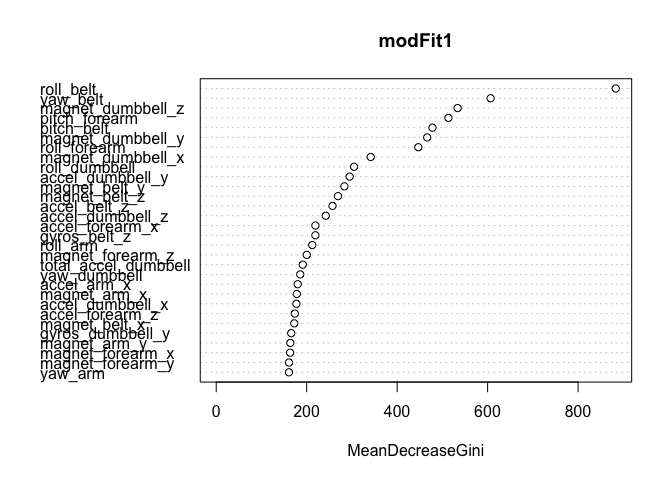
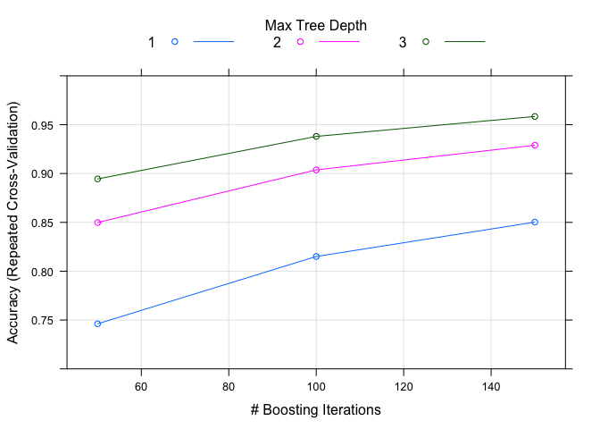

# Practical Machine Learning Project
inlbk  


##Overview

Using devices such as Jawbone Up, Nike FuelBand, and Fitbit it is now possible to collect, relatively inexpensively, a large amount of data about personal activity. One thing that people regularly do is quantify how *much* of a particular activity they do; this project seeks to determine how *well* they do it. 

To generate the data, six participants were asked to perform one set of 10 repetitions of barbell lifts in a total of 5 different ways: correctly according to the specification (Class A), throwing the elbows to the front (Class B), lifting the dumbbell only halfway (Class C), lowering the dumbbell only halfway (Class D) and throwing the hips to the front (Class E).  More information is available at the website http://groupware.les.inf.puc-rio.br/har.

Data collected from accelerometers situated on the dumbbell as well as on the belt, forearm, and arm of the participants is used to create a model to predict the activity class: A, B, C, D, or E.

##Loading R Packages


```r
# Load packages
library(plyr)
library(dplyr)
library(data.table)
library(stringr)
library(caret)
library(randomForest)
library(gbm)
library(nnet)
set.seed(5678)
```

##Getting the Data

The data, located at the following URLs, is first downloaded and read.


```r
trainUrl <- "https://d396qusza40orc.cloudfront.net/predmachlearn/pml-training.csv"
testUrl <- "https://d396qusza40orc.cloudfront.net/predmachlearn/pml-testing.csv"

# Download files and read data
download.file(trainUrl,destfile = "TrainingData.csv", method = "curl")
download.file(testUrl,destfile = "TestData.csv", method = "curl")
TrainInitDat <- read.csv("TrainingData.csv",na.strings=c("NA",""))
TrainInitDat = as.data.table(TrainInitDat)
TestInitDat <- read.csv("TestData.csv",na.strings=c("NA",""))
TestInitDat = as.data.table(TestInitDat)
dateDownloaded <- date()
```

##Cleaning and Pre-Processing the Data
Columns with a large number of NAs are identified and removed.  The first seven columns of the data are also removed since they contain user names and other information that is not relevant in creating a prediction model.


```r
# Find total number of NAs in each column. Result is 0 or 19216 NAs.
sumNA <- apply(TrainInitDat, 2, function(x) { sum(is.na(x)) })
table(sumNA)
```

```
## sumNA
##     0 19216 
##    60   100
```

```r
#Remove NA columns and columns 1-7 (not relevant) from training set.
TrainDat <- TrainInitDat[, names(which(sumNA==0)[8:60]), with=FALSE]
TrainDat <- as.data.frame(TrainDat)
TrainDat$classe <- as.factor(TrainDat$classe)

#Remove same columns from testing set, leaving 52 columns (minus "classe")
TestDat <- TestInitDat[, names(which(sumNA==0)[8:59]), with=FALSE]
TestDat <- as.data.frame(TestDat)
```

A check for variables with near zero variance is performed. No near zero variance variables remain.

```r
nearZeroVar(TrainDat, saveMetrics=FALSE)
```

```
## integer(0)
```

Both the training and testing data are centered and scaled, using the same parameters for each.


```r
preObj<-preProcess(TrainDat, method=c("center", "scale"))
TrainDatTrans<-predict(preObj, TrainDat)
testing<-predict(preObj,TestDat)
```

The final training set contains 19,622 observations of 53 variables (including the classification variable "classe"). The test set contains 20 observations of 52 variables (excluding "classe"). The variable names are listed below.


```r
names(TrainDatTrans)
```

```
##  [1] "roll_belt"            "pitch_belt"           "yaw_belt"            
##  [4] "total_accel_belt"     "gyros_belt_x"         "gyros_belt_y"        
##  [7] "gyros_belt_z"         "accel_belt_x"         "accel_belt_y"        
## [10] "accel_belt_z"         "magnet_belt_x"        "magnet_belt_y"       
## [13] "magnet_belt_z"        "roll_arm"             "pitch_arm"           
## [16] "yaw_arm"              "total_accel_arm"      "gyros_arm_x"         
## [19] "gyros_arm_y"          "gyros_arm_z"          "accel_arm_x"         
## [22] "accel_arm_y"          "accel_arm_z"          "magnet_arm_x"        
## [25] "magnet_arm_y"         "magnet_arm_z"         "roll_dumbbell"       
## [28] "pitch_dumbbell"       "yaw_dumbbell"         "total_accel_dumbbell"
## [31] "gyros_dumbbell_x"     "gyros_dumbbell_y"     "gyros_dumbbell_z"    
## [34] "accel_dumbbell_x"     "accel_dumbbell_y"     "accel_dumbbell_z"    
## [37] "magnet_dumbbell_x"    "magnet_dumbbell_y"    "magnet_dumbbell_z"   
## [40] "roll_forearm"         "pitch_forearm"        "yaw_forearm"         
## [43] "total_accel_forearm"  "gyros_forearm_x"      "gyros_forearm_y"     
## [46] "gyros_forearm_z"      "accel_forearm_x"      "accel_forearm_y"     
## [49] "accel_forearm_z"      "magnet_forearm_x"     "magnet_forearm_y"    
## [52] "magnet_forearm_z"     "classe"
```

##Training and Validation Data Sets

The training data is randomly split into two sets: 70% of the data (13,737 observations) is used for training the prediction models and the remaining 5,885 observations (hereafter called the "validation set") is used for evaluating the efficacy of the models.


```r
#Split into training and validation sets
intrain <- createDataPartition(y = TrainDatTrans$classe, p=0.7)[[1]]
training <- TrainDatTrans[intrain,]
validation <- TrainDatTrans[-intrain,]
```

Three different prediction models will be created using the training data, and the model with the highest accuracy on the validation set will be selected.

##First Model: Random Forests

The first model uses random forests. This model was selected because it gave good results on a homework problem for the Practical Machine Learning course.

```r
set.seed(5678)
modFit1 <- randomForest(classe ~ ., data=training)
prediction1 <- predict(modFit1, validation[,1:52])
cmval1 <- confusionMatrix(prediction1, validation$classe)
cmval1
```

```
## Confusion Matrix and Statistics
## 
##           Reference
## Prediction    A    B    C    D    E
##          A 1673    2    0    0    0
##          B    1 1136    2    0    0
##          C    0    1 1023   14    0
##          D    0    0    1  949    2
##          E    0    0    0    1 1080
## 
## Overall Statistics
##                                           
##                Accuracy : 0.9959          
##                  95% CI : (0.9939, 0.9974)
##     No Information Rate : 0.2845          
##     P-Value [Acc > NIR] : < 2.2e-16       
##                                           
##                   Kappa : 0.9948          
##  Mcnemar's Test P-Value : NA              
## 
## Statistics by Class:
## 
##                      Class: A Class: B Class: C Class: D Class: E
## Sensitivity            0.9994   0.9974   0.9971   0.9844   0.9982
## Specificity            0.9995   0.9994   0.9969   0.9994   0.9998
## Pos Pred Value         0.9988   0.9974   0.9855   0.9968   0.9991
## Neg Pred Value         0.9998   0.9994   0.9994   0.9970   0.9996
## Prevalence             0.2845   0.1935   0.1743   0.1638   0.1839
## Detection Rate         0.2843   0.1930   0.1738   0.1613   0.1835
## Detection Prevalence   0.2846   0.1935   0.1764   0.1618   0.1837
## Balanced Accuracy      0.9995   0.9984   0.9970   0.9919   0.9990
```

```r
randomForest::varImpPlot(modFit1)
```

<!-- -->

##Second Model: Generalized Boosted Regression

The second model uses generalized boosted regression. With boosting, a group of weak predictors can be combined and weighted to become a much stronger predictor. 

```r
set.seed(5678)
control <- trainControl(method = "repeatedcv", number = 3, repeats = 2)
modFit2 <- train(classe ~ ., data=training, method = "gbm", verbose = FALSE, trControl = control)
prediction2 <- predict(modFit2, validation[,1:52])
cmval2 <- confusionMatrix(prediction2, validation$classe)
cmval2
```

```
## Confusion Matrix and Statistics
## 
##           Reference
## Prediction    A    B    C    D    E
##          A 1651   37    0    0    0
##          B   11 1061   23    2   12
##          C   10   33  988   41   10
##          D    2    4   14  914    9
##          E    0    4    1    7 1051
## 
## Overall Statistics
##                                           
##                Accuracy : 0.9626          
##                  95% CI : (0.9575, 0.9673)
##     No Information Rate : 0.2845          
##     P-Value [Acc > NIR] : < 2.2e-16       
##                                           
##                   Kappa : 0.9527          
##  Mcnemar's Test P-Value : NA              
## 
## Statistics by Class:
## 
##                      Class: A Class: B Class: C Class: D Class: E
## Sensitivity            0.9863   0.9315   0.9630   0.9481   0.9713
## Specificity            0.9912   0.9899   0.9807   0.9941   0.9975
## Pos Pred Value         0.9781   0.9567   0.9131   0.9692   0.9887
## Neg Pred Value         0.9945   0.9837   0.9921   0.9899   0.9936
## Prevalence             0.2845   0.1935   0.1743   0.1638   0.1839
## Detection Rate         0.2805   0.1803   0.1679   0.1553   0.1786
## Detection Prevalence   0.2868   0.1884   0.1839   0.1602   0.1806
## Balanced Accuracy      0.9887   0.9607   0.9718   0.9711   0.9844
```

```r
plot(modFit2, ylim=c(0.7, 1))
```

<!-- -->

##Third Model: Neural Network

The third model is a feedforward neural network with one hidden layer containing 17 hidden units.


```r
library(nnet)
set.seed(5678)
modFit3<-nnet(classe~., data=training, size=17, maxit=400, trace=FALSE)
prediction3 <- predict(modFit3, validation[,1:52], type="class")
cmval3 <- confusionMatrix(prediction3, validation$classe)
cmval3
```

```
## Confusion Matrix and Statistics
## 
##           Reference
## Prediction    A    B    C    D    E
##          A 1623   40    1   18    9
##          B   29 1013   39   11   41
##          C    9   44  941   49   27
##          D    8   15   31  864   16
##          E    5   27   14   22  989
## 
## Overall Statistics
##                                           
##                Accuracy : 0.9227          
##                  95% CI : (0.9156, 0.9294)
##     No Information Rate : 0.2845          
##     P-Value [Acc > NIR] : < 2.2e-16       
##                                           
##                   Kappa : 0.9022          
##  Mcnemar's Test P-Value : 0.003659        
## 
## Statistics by Class:
## 
##                      Class: A Class: B Class: C Class: D Class: E
## Sensitivity            0.9695   0.8894   0.9172   0.8963   0.9140
## Specificity            0.9839   0.9747   0.9735   0.9858   0.9858
## Pos Pred Value         0.9598   0.8941   0.8794   0.9251   0.9357
## Neg Pred Value         0.9878   0.9735   0.9823   0.9798   0.9807
## Prevalence             0.2845   0.1935   0.1743   0.1638   0.1839
## Detection Rate         0.2758   0.1721   0.1599   0.1468   0.1681
## Detection Prevalence   0.2873   0.1925   0.1818   0.1587   0.1796
## Balanced Accuracy      0.9767   0.9320   0.9453   0.9410   0.9499
```

##Comparison of Models

When applied to the validation set, the Random Forest model has an accuracy of 99.6%, the Generalized Boosted Regression model has an accuracy of 96.3%, and the Neural Network model has an accuracy of 92.3%. Because of its high accuracy, the Random Forest model was selected to make predictions on the test set. The expected out-of-sample error for the Random Forest model is 0.41%.

##Prediction on the Test Set

Predicted classes for each of the 20 observations in the testing set are listed below.

```r
testpredict <- predict(modFit1, testing)
testpredict
```

```
##  1  2  3  4  5  6  7  8  9 10 11 12 13 14 15 16 17 18 19 20 
##  B  A  B  A  A  E  D  B  A  A  B  C  B  A  E  E  A  B  B  B 
## Levels: A B C D E
```

